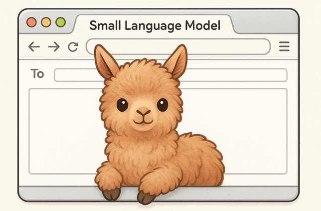
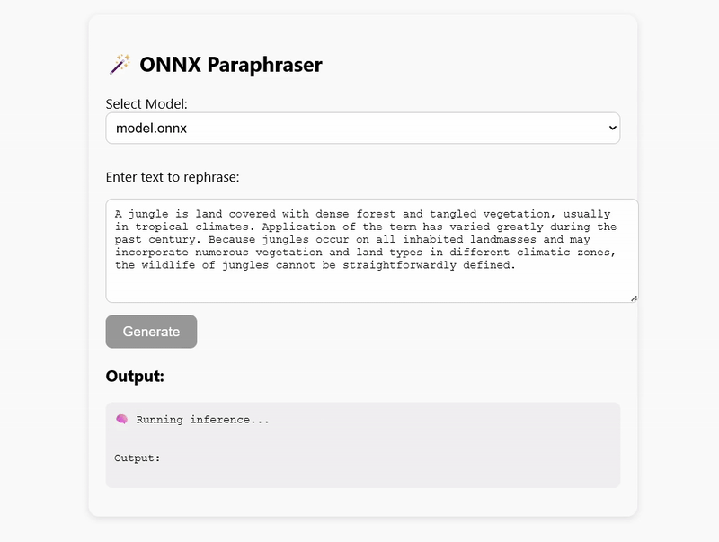

# Introduction



This repository is part of [playbook for experiments on fine tuning small language models](https://ashishware.com/2025/11/16/slm_in_browser/) using LoRA, exporting them to ONNX and running them locally using ONNX compatibale runtime  like javascript(node js) and WASM (browser)

### Before you start

- Clone the repository.
- From  [https://huggingface.co/code2022/SmolLM2-135M-Instruct-Paraphrase/tree/main](https://huggingface.co/code2022/SmolLM2-135M-Instruct-Paraphrase/tree/main)
  copy `model.onnx` to the `model_files` directory of the repository.
- Run `npm install`

### To run NodeJS example (NodeJS + onnx-runtime, server side)

- Simple run `node app.js`

This is what you should see


### To run web browser based demo (WASM based in-browser inference)

- Simply access `web.html` from a local server (example `http://localhost:3000/web.html`)

This is what you should see 



### Train and export your own model:
https://www.kaggle.com/code/finalepoch/fine-tuning-smollm2-135m-for-paraphrasing-tasks 

### Testing custom trained models:
https://www.kaggle.com/code/finalepoch/smollm-360-lora-onnx-inference

### Citation

```
@misc{allal2024SmolLM,
      title={SmolLM - blazingly fast and remarkably powerful}, 
      author={Loubna Ben Allal and Anton Lozhkov and Elie Bakouch and Leandro von Werra and Thomas Wolf},
      year={2024},
}
```
